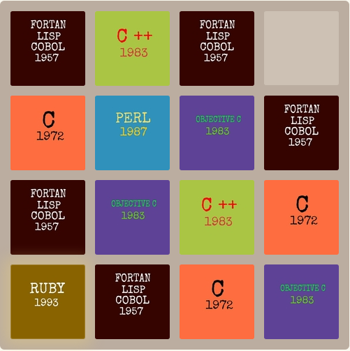

# Match-and-learn

It's a interesting and addictive game modified by [Shivam srivastava](https://github.com/er1shivam/).

You can learn the evolution of languages in programming from history while playing it.

My version:  [match-and-learn](http://er1shivam.github.io/match-and-learn/) 

Note: This original version is made by  <a href="https://www.github.com/gabrielecirulli" target="_blank">Gabrielecirulli</a> from a small clone of [1024](https://play.google.com/store/apps/details?id=com.veewo.a1024), based on [Saming's 2048](http://saming.fr/p/2048/) (also a clone).

Gabriel version: [Play it here!](http://gabrielecirulli.github.io/2048/)

The official app can also be found on the [Play Store](https://play.google.com/store/apps/details?id=com.gabrielecirulli.app2048) and [App Store!](https://itunes.apple.com/us/app/2048-by-gabriele-cirulli/id868076805)

  

:smile:

## Contributing
Changes and improvements are more than welcome! Feel free to fork and open a pull request. Please make your changes in a specific branch and request to pull into `master`! 

Thank you very much!
